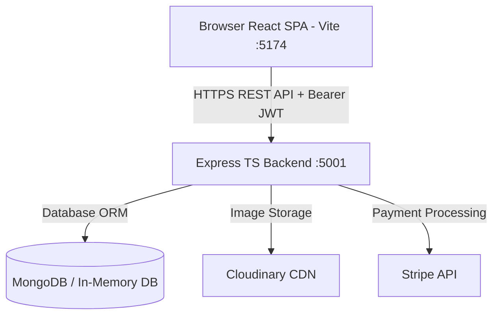

# 🏨 Hotel Booking & Management System (MERN Stack)

[](https://opensource.org/licenses/MIT)
[](https://www.typescriptlang.org/)
[](https://react.dev/)
[](https://nodejs.org/)
[](https://expressjs.com/)
[](https://www.mongodb.com/)
[](https://vitejs.dev/)
[](https://tailwindcss.com/)
[](https://stripe.com/)
[](https://cloudinary.com/)

A modern, production-grade **Full-Stack Hotel Booking & Business Management System** built with the **MERN** stack (MongoDB, Express, React 18, Node.js) and 100% **TypeScript**. Designed for scalability, security, and exceptional user experience with localized Arab world content, comprehensive admin controls, revenue analytics, and seamless payment processing.

---

## 🌟 Key Features

### 🧳 1. Guest Experience (Travelers)
- **Real-Time Hotel Search & Filtering:** Filter hotels by destination, check-in/out dates, guest count, price range, star rating, hotel types, and luxury amenities.
- **Interactive Hotel Details:** View photo galleries, room amenities, guest reviews, and property policies.
- **Stripe Payments Integration:** Secure online room reservations with **Stripe PaymentIntents**.
- **Guest Dashboard:** View and manage personal booking history via `/my-bookings`.

### 🏢 2. Hotel Owners Portal
- **Property Management:** Add, edit, and update hotel listings with multi-file image uploads powered by **Cloudinary**.
- **Booking Overview:** Track property bookings, status, and earnings per hotel listing (`/my-hotels`).

### 👑 3. Executive Admin Control Center (`/admin`)
- **Users & Registration Audit (`/admin/users`):** View all registered users, roles (Admin / Owner / Guest), and account creation timestamps.
- **Global Bookings Management (`/admin/bookings`):** Inspect all platform bookings, guest details, payment statuses, and date ranges.
- **Hotel Fleet Auditing (`/admin/hotels`):** Centralized oversight for all active properties across the platform.
- **Review Moderation (`/admin/reviews`):** Monitor guest feedback and review ratings.
- **Real-Time Activity Log (`/admin/activity`):** Audit operational logs and platform events.

### 📊 4. Business Insights & Analytics (`/business-insights`)
- Visual interactive charts powered by **Recharts** displaying key metrics: total revenue, active bookings, occupancy rates, and top-performing destinations.

### 📚 5. Developer Experience & API Docs
- **Swagger Interactive API Documentation:** Explore and test all endpoints live at `/api-docs`.
- **Health Check UI & Endpoint:** Monitor database connection and server status at `/api/health`.

---

## 🔑 Pre-Seeded Test Credentials

The backend includes an **auto-seeding memory database** with pre-populated demo data (Arab world destinations, authentic user accounts, and real hotel listings):

| Role | Email | Password | Access / Dashboard |
| :--- | :--- | :--- | :--- |
| 👑 **Administrator** | `test@user.com` | `12345678` | Full Admin Console (`/admin`), User & Booking Audit |
| 🏢 **Hotel Owner** | `owner@hotel.com` | `12345678` | Property Management (`/my-hotels`), Add Hotel (`/add-hotel`) |
| 🧳 **Guest Traveler** | `guest@user.com` | `12345678` | Hotel Search, Stripe Checkout, My Bookings (`/my-bookings`) |

---

## 🏗️ Architecture Overview



---

## 📂 Repository Structure

```text
├── hotel-booking-backend/     # Express + Mongoose + TypeScript API
│   ├── src/
│   │   ├── index.ts           # Server entry point, CORS, Rate Limiting
│   │   ├── routes/            # REST API endpoints (Auth, Users, Hotels, Bookings, Admin)
│   │   ├── models/            # Mongoose Schemas (User, Hotel, Booking, Review, Analytics)
│   │   ├── scripts/seed.ts    # Automated demo data seeder
│   │   └── swagger.ts         # Swagger UI API spec
│   └── package.json
├── hotel-booking-frontend/    # React 18 + Vite + Tailwind CSS SPA
│   ├── src/
│   │   ├── pages/             # App views (Home, Search, Detail, Admin, Insights, Auth)
│   │   ├── components/        # Reusable UI components & Layouts
│   │   ├── api-client.ts      # Axios API service layer
│   │   └── contexts/          # App & Search state contexts
│   └── package.json
├── shared/
│   └── types.ts               # Shared TypeScript interfaces & DTOs
├── e2e-tests/                 # Playwright End-to-End test suite
└── README.md                  # Project Documentation
```

---

## 🛠️ Tech Stack & Technologies

- **Frontend:** React 18, Vite, TypeScript, Tailwind CSS, TanStack React Query (v3), Axios, React Router v6, Sonner Toasts, Lucide Icons, Recharts.
- **Backend:** Node.js, Express.js, TypeScript, Mongoose, MongoDB, JWT (JSON Web Tokens), bcryptjs, Cloudinary SDK, Stripe SDK, Helmet, Compression, Express Rate Limit, Swagger UI.
- **Testing:** Playwright E2E testing framework.

---

## ⚡ How to Run Locally

### Prerequisites
- Node.js (v18+)
- npm

### 1. Run Backend Server
```bash
cd hotel-booking-backend
npm install
npm run dev
```
*Backend server will start at `http://localhost:5001` with automated in-memory MongoDB seeding.*

### 2. Run Frontend Application
```bash
cd hotel-booking-frontend
npm install
npm run dev
```
*Frontend application will start at `http://localhost:5174`.*

---

## 📝 Verification & Build Checks

```bash
# Build Backend
cd hotel-booking-backend && npm run build

# Build & Lint Frontend
cd hotel-booking-frontend && npm run build && npm run lint
```

---

## 📄 License

This project is licensed under the [MIT License](LICENSE). Built by **Ahmed Abed**.
